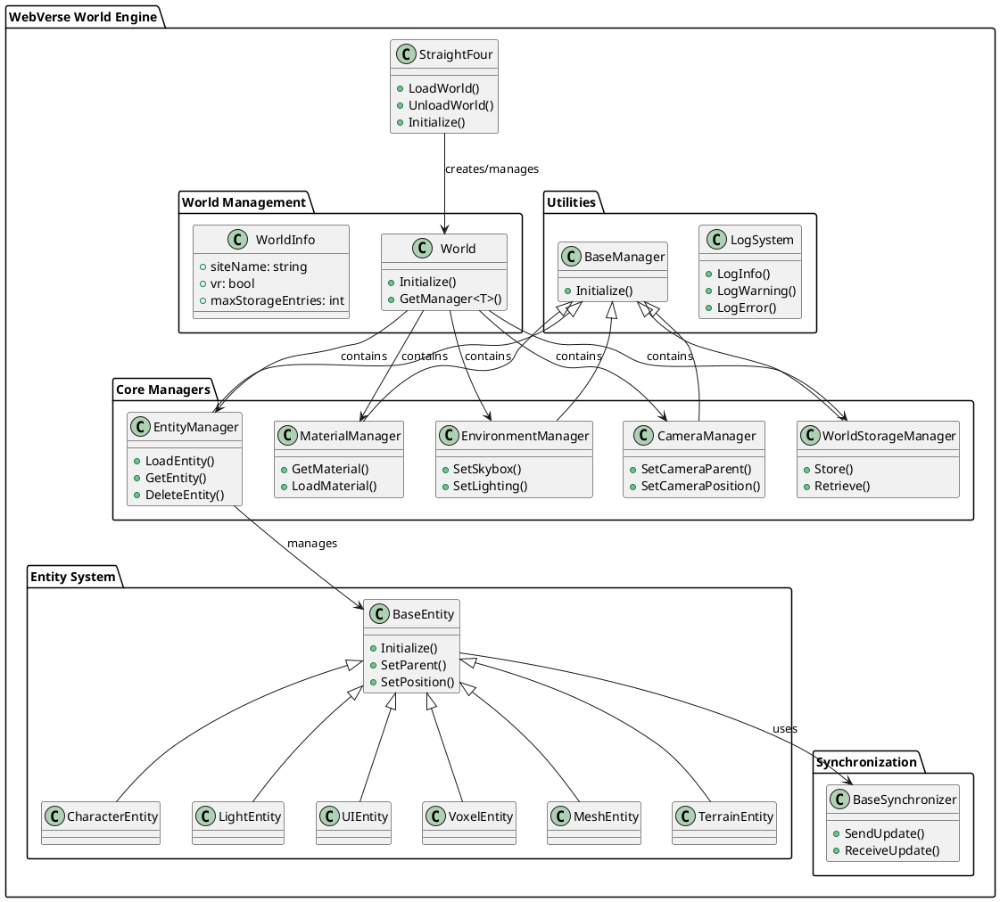
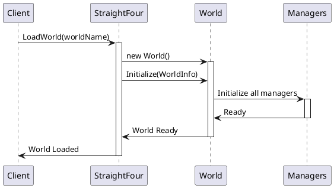
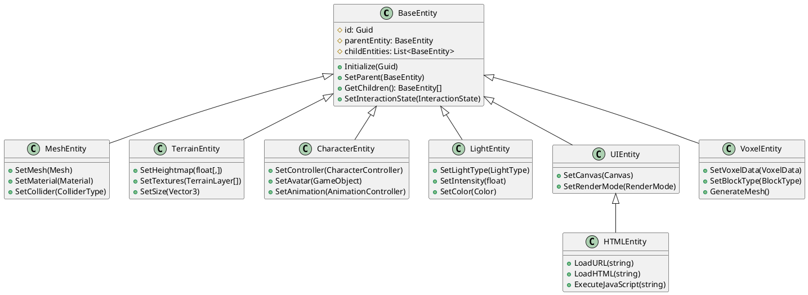
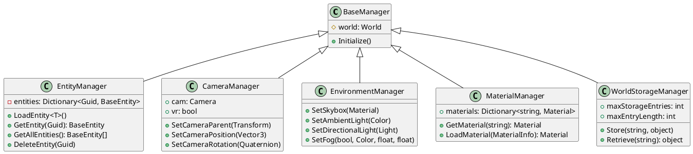
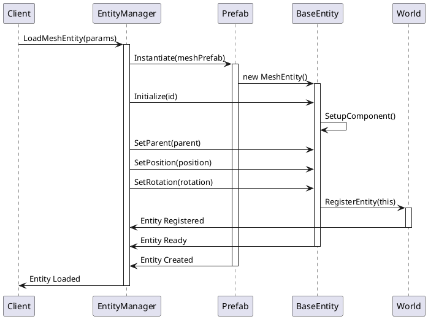
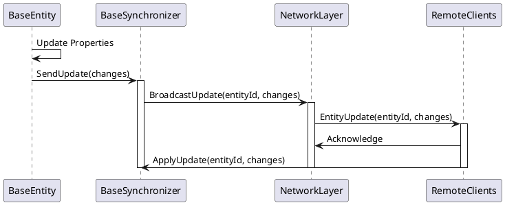

# Architecture Overview

This document provides a comprehensive overview of the WebVerse World Engine architecture, including system components, data flows, and design patterns.

## High-Level Architecture

The WebVerse World Engine follows a modular, component-based architecture built on Unity's GameObject/MonoBehaviour system. The engine is organized into several key subsystems:

## System Components

### 1. StraightFour (Main Engine Controller)

The `StraightFour` class serves as the primary entry point and controller for the world engine. It manages:

- World loading and unloading
- Engine initialization
- Configuration management
- Query parameter processing

**Key Responsibilities:**
- Initialize engine subsystems
- Load and manage world instances
- Handle VR/AR mode configuration
- Manage prefab references for entity creation

### 2. World Management System

The world management system handles the lifecycle of virtual worlds:

### 3. Entity System Architecture

The entity system uses a hierarchical component-based architecture:

### 4. Manager System

All major subsystems inherit from `BaseManager` and follow a consistent initialization pattern:

## Data Flow Architecture

### Entity Creation Flow

### Synchronization Flow

## Design Patterns

### 1. Manager Pattern

Each major subsystem is implemented as a manager that inherits from `BaseManager`. This provides:
- Consistent initialization
- World context access
- Uniform lifecycle management

### 2. Component Pattern

Entities use Unity's component system for modularity:
- BaseEntity provides core functionality
- Specialized entities extend BaseEntity
- Components can be added/removed dynamically

### 3. Factory Pattern

Entity creation uses factory methods in EntityManager:
- Centralized entity creation logic
- Consistent initialization
- Type safety

### 4. Observer Pattern

Synchronization system uses observer pattern:
- Entities notify synchronizers of changes
- Synchronizers broadcast updates
- Remote clients observe and apply changes

## Performance Considerations

### Memory Management
- Entity pooling for frequently created/destroyed objects
- Material sharing to reduce memory footprint
- Texture compression and LOD systems

### Rendering Optimization
- Frustum culling for off-screen entities
- LOD (Level of Detail) systems for complex meshes
- Batching for similar materials

### Network Optimization
- Delta compression for synchronization
- Priority-based updates
- Bandwidth throttling

## Integration Points

### Unity Integration
- Built on Unity 2021.3.26 with URP
- Leverages Unity's physics, rendering, and input systems
- Compatible with Unity's XR framework for VR/AR

### WebVerse Ecosystem
- Integrates with WebVerse main application via APIs
- Supports VEML (Virtual Environment Markup Language)
- Compatible with VOS Synchronization Service

### Third-Party Integrations
- Vuplex WebView for HTML content
- NWH Vehicle Physics for automobiles
- Digger for terrain modification (optional)

This architecture provides a solid foundation for creating immersive, interactive virtual worlds while maintaining extensibility and performance.