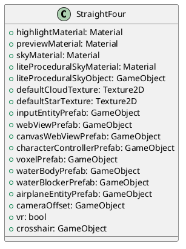
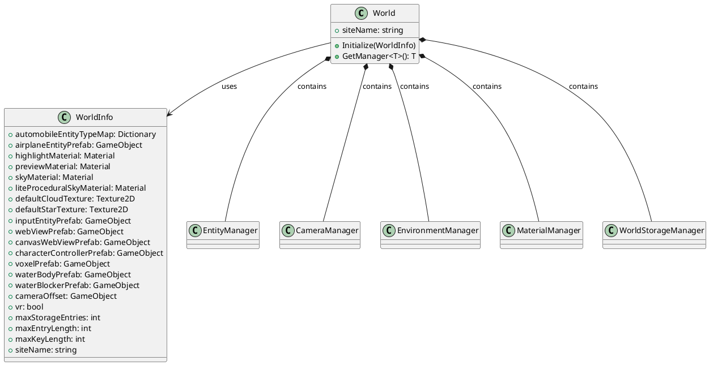
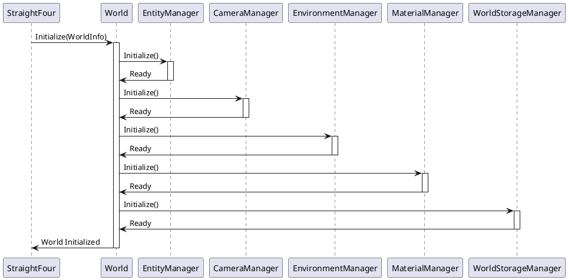
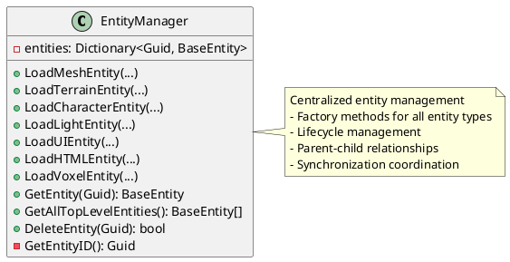
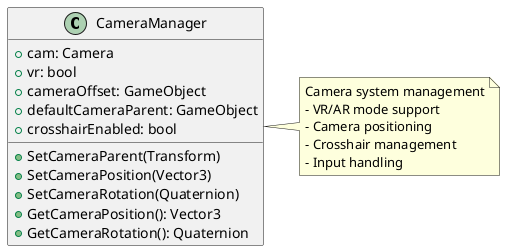
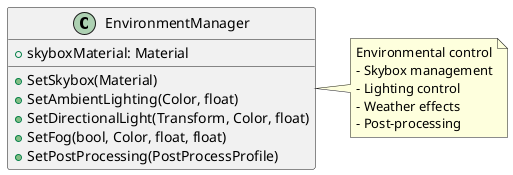
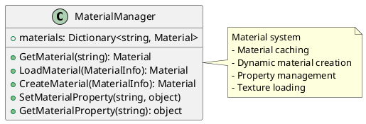
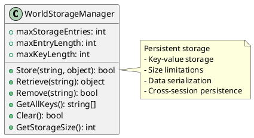
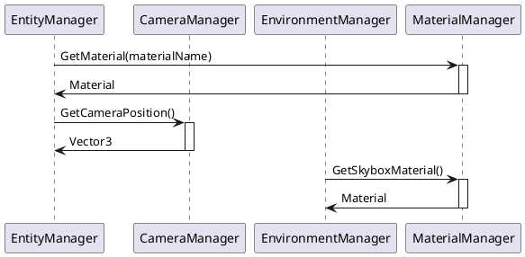
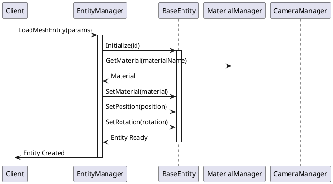

# Core Components

This document provides detailed information about the core components of the WebVerse World Engine and their interactions.

## Overview

The WebVerse World Engine is composed of several key components that work together to provide a comprehensive virtual world framework:

1. **StraightFour** - Main engine controller
2. **World** - World container and manager coordinator
3. **Manager System** - Specialized subsystem managers
4. **Entity System** - Game objects and components
5. **Utilities** - Common functionality and helpers

## StraightFour - Main Engine Controller

The `StraightFour` class is the primary entry point and singleton controller for the entire world engine.

### Key Features

- **Singleton Pattern**: Provides global access to engine functionality
- **World Management**: Handles world loading, unloading, and lifecycle
- **Configuration Management**: Manages engine settings and prefab references
- **VR/AR Support**: Handles VR/AR mode initialization and configuration

### Core Methods

```csharp
public class StraightFour : MonoBehaviour
{
    // Static access to the active world
    public static World.World ActiveWorld { get; }
    
    // Load a new world
    public static bool LoadWorld(string worldName, string queryParams = null)
    
    // Initialize the engine
    private void Awake()
    
    // Load query parameters
    private void LoadQueryParams(string rawParams)
}
```

### Configuration Properties



## World - World Container

The `World` class represents a single virtual world instance and coordinates all managers and systems.

### Architecture



### Initialization Flow



## Manager System

### BaseManager

All managers inherit from `BaseManager`, providing a consistent interface and lifecycle:

```csharp
public abstract class BaseManager : MonoBehaviour
{
    protected World.World world;
    
    public abstract void Initialize();
}
```

### EntityManager

Manages all entities in the world, providing creation, retrieval, and destruction functionality.



#### Key Methods

- **Entity Creation**: Factory methods for each entity type
- **Entity Retrieval**: Get entities by ID or query all entities
- **Entity Management**: Delete, modify, and organize entities
- **Prefab Management**: Handle entity prefab instantiation

### CameraManager

Manages the world's camera system, including VR/AR support:



### EnvironmentManager

Handles environmental settings and rendering:



### MaterialManager

Manages materials and textures for the world:



### WorldStorageManager

Provides persistent storage for world data:



## Component Interactions

### Manager Communication



### Entity-Manager Interaction



## Utilities System

### LogSystem

Provides centralized logging functionality:

```csharp
public static class LogSystem
{
    public static void LogInfo(string message)
    public static void LogWarning(string message) 
    public static void LogError(string message)
}
```

### Tags System

Manages entity tags for categorization and querying:

```csharp
public static class Tags
{
    public const string Player = "Player";
    public const string Environment = "Environment";
    public const string UI = "UI";
    // ... other predefined tags
}
```

## Integration Points

### Unity Integration

- **MonoBehaviour Lifecycle**: All components follow Unity's lifecycle
- **GameObject Hierarchy**: Entities maintain Unity's transform hierarchy  
- **Physics Integration**: Full integration with Unity's physics system
- **Rendering Pipeline**: Compatible with Unity's URP (Universal Render Pipeline)

### External Systems

- **WebVerse API**: Provides JavaScript APIs for world manipulation
- **VEML Support**: Virtual Environment Markup Language integration
- **VR/AR Systems**: Unity XR Toolkit integration
- **Networking**: VSS (VOS Synchronization Service) integration

## Performance Considerations

### Memory Management

- **Object Pooling**: Reuse frequently created/destroyed objects
- **Material Sharing**: Single material instances shared across entities
- **Texture Compression**: Automatic texture optimization

### Rendering Optimization  

- **Frustum Culling**: Automatic culling of off-screen objects
- **LOD System**: Level-of-detail for complex meshes
- **Batching**: Automatic draw call batching for similar objects

### Update Optimization

- **Dirty Flagging**: Only update changed properties
- **Batch Processing**: Group similar operations
- **Frame Distribution**: Spread expensive operations across frames

This component architecture provides a robust, extensible foundation for building immersive virtual worlds while maintaining high performance and ease of use.