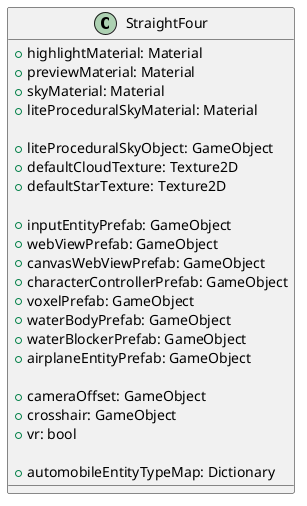
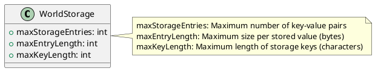
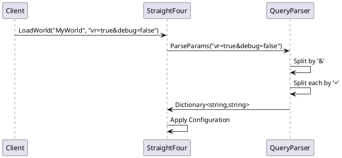
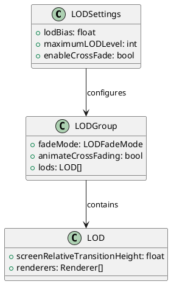
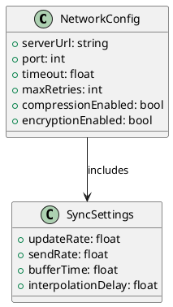

# Configuration

This document covers all configuration options, settings, and customization possibilities for the WebVerse World Engine.

## Overview

The WebVerse World Engine can be configured at multiple levels:

1. **Engine Configuration** - Core engine settings in StraightFour
2. **World Configuration** - Per-world settings via WorldInfo
3. **Unity Project Settings** - Unity-specific configurations
4. **Runtime Configuration** - Query parameters and runtime settings

## Engine Configuration

### StraightFour Component Configuration

The main `StraightFour` component in your scene requires configuration of various prefabs and materials:



### Required Prefabs

#### Entity Prefabs

1. **inputEntityPrefab** - Prefab for input handling entities
2. **characterControllerPrefab** - Character controller for avatars
3. **voxelPrefab** - Base prefab for voxel entities
4. **waterBodyPrefab** - Water body entity prefab
5. **waterBlockerPrefab** - Water blocking entity prefab
6. **airplaneEntityPrefab** - Aircraft entity prefab

#### UI Prefabs

1. **webViewPrefab** - Standard web view component (requires Vuplex)
2. **canvasWebViewPrefab** - Canvas-based web view component

#### Camera and UI

1. **cameraOffset** - VR camera offset object
2. **crosshair** - Crosshair UI element

### Required Materials

#### Rendering Materials

```csharp
[Tooltip("Material to use for object highlighting.")]
public Material highlightMaterial;

[Tooltip("Material to use for object previewing.")]
public Material previewMaterial;

[Tooltip("Material to use for the environment sky.")]
public Material skyMaterial;

[Tooltip("Material to use for the lite procedural sky.")]
public Material liteProceduralSkyMaterial;
```

#### Texture Assets

```csharp
public Texture2D defaultCloudTexture;
public Texture2D defaultStarTexture;
```

### VR/AR Configuration

```csharp
[Tooltip("Whether or not world is in VR mode.")]
public bool vr = false;
```

**VR Setup Requirements:**
- Unity XR Toolkit installed
- XR Rig configured in scene
- VR SDK (Oculus, OpenVR, etc.) installed
- Camera offset GameObject for VR positioning

### Vehicle Configuration

```csharp
public Dictionary<EntityManager.AutomobileEntityType, 
    NWH.VehiclePhysics2.StateSettings> automobileEntityTypeMap;
```

**Automobile Types:**
- `Default` - Standard vehicle configuration
- `SportsCar` - High-performance vehicle
- `Truck` - Heavy vehicle with different physics
- `Motorcycle` - Two-wheeled vehicle

## World Configuration

### WorldInfo Structure

```csharp
public class WorldInfo
{
    // Vehicle Configuration
    public Dictionary<EntityManager.AutomobileEntityType,
        NWH.VehiclePhysics2.StateSettings> automobileEntityTypeMap;
    public GameObject airplaneEntityPrefab;
    
    // Rendering Materials
    public Material highlightMaterial;
    public Material previewMaterial;
    public Material skyMaterial;
    public Material liteProceduralSkyMaterial;
    
    // Environment Textures
    public Texture2D defaultCloudTexture;
    public Texture2D defaultStarTexture;
    
    // Entity Prefabs
    public GameObject inputEntityPrefab;
    public GameObject webViewPrefab;
    public GameObject canvasWebViewPrefab;
    public GameObject characterControllerPrefab;
    public GameObject voxelPrefab;
    public GameObject waterBodyPrefab;
    public GameObject waterBlockerPrefab;
    
    // Camera Configuration
    public GameObject cameraOffset;
    public bool vr;
    
    // Storage Configuration
    [Range(0, int.MaxValue)]
    public int maxStorageEntries = 2048;
    
    [Range(0, int.MaxValue)]
    public int maxEntryLength = 2048;
    
    [Range(0, int.MaxValue)]
    public int maxKeyLength = 128;
    
    // World Identity
    public string siteName;
}
```

### Storage Configuration

Control persistent storage limits:



**Default Values:**
- `maxStorageEntries`: 2048
- `maxEntryLength`: 2048 bytes
- `maxKeyLength`: 128 characters

### World Creation Example

```csharp
WorldInfo worldInfo = new WorldInfo
{
    siteName = "MyVirtualWorld",
    vr = false,
    maxStorageEntries = 4096,
    maxEntryLength = 4096,
    maxKeyLength = 256,
    
    // Copy materials from StraightFour instance
    highlightMaterial = StraightFour.instance.highlightMaterial,
    previewMaterial = StraightFour.instance.previewMaterial,
    skyMaterial = StraightFour.instance.skyMaterial,
    
    // Copy prefabs
    characterControllerPrefab = StraightFour.instance.characterControllerPrefab,
    webViewPrefab = StraightFour.instance.webViewPrefab,
    // ... other prefabs
};

bool success = StraightFour.LoadWorld("MyWorld", worldInfo);
```

## Unity Project Configuration

### Package Dependencies

Required packages in `Packages/manifest.json`:

```json
{
  "dependencies": {
    "com.unity.ai.navigation": "1.1.5",
    "com.unity.burst": "1.8.12",
    "com.unity.inputsystem": "1.7.0",
    "com.unity.render-pipelines.universal": "14.0.10",
    "com.unity.test-framework": "1.1.33",
    "com.unity.textmeshpro": "3.0.6",
    "com.unity.ugui": "1.0.0"
  }
}
```

### Project Settings

#### Graphics Settings

1. **Render Pipeline**: Universal Render Pipeline (URP)
2. **Color Space**: Linear
3. **Graphics API**: DirectX 11/Vulkan (Windows), Metal (Mac), OpenGL ES 3.0+ (Mobile)

#### Physics Settings

```csharp
// Recommended physics settings
Time.fixedDeltaTime = 0.02f; // 50Hz physics
Physics.defaultContactOffset = 0.01f;
Physics.sleepThreshold = 0.005f;
Physics.defaultSolverIterations = 6;
Physics.defaultSolverVelocityIterations = 1;
```

#### Input System

Enable the new Input System in Player Settings:
- **Active Input Handling**: Input System Package (New)

### XR Configuration (VR/AR)

#### XR Plugin Management

1. Install XR Plugin Management
2. Enable desired providers:
   - Oculus (Meta Quest)
   - OpenVR (Steam VR)
   - Windows Mixed Reality
   - ARCore (Android AR)
   - ARKit (iOS AR)

#### XR Interaction Toolkit

Required components for VR interaction:
- XR Rig
- XR Ray Interactor
- XR Direct Interactor
- XR Grab Interactable

## Runtime Configuration

### Query Parameters

Configure worlds at runtime using URL-style query parameters:

```csharp
StraightFour.LoadWorld("MyWorld", "vr=true&multiplayer=true&maxPlayers=10");
```

#### Supported Parameters

| Parameter | Type | Description | Default |
|-----------|------|-------------|---------|
| `vr` | boolean | Enable VR mode | false |
| `multiplayer` | boolean | Enable multiplayer | false |
| `maxPlayers` | integer | Maximum players | 10 |
| `debug` | boolean | Enable debug mode | false |
| `quality` | string | Graphics quality (low/medium/high) | medium |
| `physics` | boolean | Enable physics simulation | true |
| `shadows` | boolean | Enable shadows | true |
| `antialiasing` | integer | MSAA level (0,2,4,8) | 4 |

#### Query Parameter Processing



### Environment Variables

System environment variables can influence engine behavior:

- `WEBVERSE_LOG_LEVEL` - Logging verbosity (DEBUG, INFO, WARNING, ERROR)
- `WEBVERSE_MAX_ENTITIES` - Global entity limit override
- `WEBVERSE_VR_ENABLED` - Force VR mode on/off
- `WEBVERSE_QUALITY_LEVEL` - Override graphics quality

## Performance Configuration

### Quality Settings

Configure performance vs. quality tradeoffs:

```csharp
public class PerformanceConfig
{
    public enum QualityLevel
    {
        Low,
        Medium,  
        High,
        Ultra
    }
    
    public QualityLevel graphicsQuality = QualityLevel.Medium;
    public bool enableShadows = true;
    public int shadowDistance = 50;
    public bool enableReflections = true;
    public int maxEntityCount = 1000;
    public float updateFrequency = 60f; // Hz
}
```

### LOD Configuration

Level-of-Detail settings for performance optimization:



### Culling Configuration

Optimize rendering through culling settings:

```csharp
public class CullingConfig
{
    public float frustumCullingDistance = 1000f;
    public bool enableOcclusionCulling = true;
    public float occlusionCullingAccuracy = 0.25f;
    public int maxVisibleEntities = 500;
}
```

## Network Configuration

### Synchronization Settings

Configure network synchronization behavior:

```csharp
public class SyncConfig
{
    public float minUpdateInterval = 0.1f; // Minimum time between updates
    public int maxUpdatesPerFrame = 10;    // Bandwidth limiting
    public bool enableInterpolation = true; // Smooth movement
    public bool enableExtrapolation = true; // Predict movement
    public float networkTolerance = 0.1f;   // Position sync tolerance
}
```

### Connection Settings



## Debug Configuration

### Logging Configuration

```csharp
public enum LogLevel
{
    Debug = 0,
    Info = 1,
    Warning = 2,
    Error = 3,
    None = 4
}

public class LogConfig
{
    public LogLevel logLevel = LogLevel.Info;
    public bool logToConsole = true;
    public bool logToFile = false;
    public string logFilePath = "Logs/webverse.log";
    public bool includeStackTrace = false;
}
```

### Visual Debugging

Enable visual debugging features:

```csharp
public class DebugConfig
{
    public bool showEntityBounds = false;
    public bool showWireframes = false;
    public bool showColliders = false;
    public bool showEntityIDs = false;
    public bool showPerformanceStats = false;
    public bool enableGizmos = false;
}
```

## Custom Configuration

### Configuration Files

Create custom configuration files for complex setups:

```json
{
  "world": {
    "name": "MyWorld",
    "vr": false,
    "maxEntities": 2000
  },
  "graphics": {
    "quality": "high",
    "shadows": true,
    "reflections": true,
    "antialiasing": 4
  },
  "physics": {
    "gravity": -9.81,
    "timestep": 0.02,
    "iterations": 6
  },
  "networking": {
    "enabled": true,
    "server": "ws://localhost:8080",
    "timeout": 30.0
  }
}
```

### Configuration Manager

Implement a custom configuration manager:

```csharp
public class ConfigurationManager : MonoBehaviour
{
    public static ConfigurationManager Instance { get; private set; }
    
    [SerializeField] private string configFilePath = "config.json";
    private ConfigData config;
    
    private void Awake()
    {
        Instance = this;
        LoadConfiguration();
    }
    
    public void LoadConfiguration()
    {
        string jsonContent = File.ReadAllText(configFilePath);
        config = JsonUtility.FromJson<ConfigData>(jsonContent);
        ApplyConfiguration();
    }
    
    public void SaveConfiguration()
    {
        string jsonContent = JsonUtility.ToJson(config, true);
        File.WriteAllText(configFilePath, jsonContent);
    }
    
    private void ApplyConfiguration()
    {
        // Apply loaded configuration to engine
        QualitySettings.SetQualityLevel(config.graphics.qualityLevel);
        Physics.gravity = new Vector3(0, config.physics.gravity, 0);
        // ... apply other settings
    }
}
```

## Best Practices

### Configuration Management

1. **Centralize Configuration**: Keep all settings in one place
2. **Validate Settings**: Check configuration values at startup
3. **Provide Defaults**: Always have fallback values
4. **Document Settings**: Comment all configuration options

### Performance Optimization

1. **Profile First**: Measure performance before optimizing
2. **Gradual Degradation**: Reduce quality gracefully on lower-end hardware
3. **User Choice**: Allow users to adjust settings
4. **Monitor Resources**: Track memory and CPU usage

### Platform Considerations

1. **Platform-Specific Settings**: Different configurations for PC, Mobile, VR
2. **Hardware Detection**: Automatically adjust settings based on hardware
3. **Testing Matrix**: Test on various hardware configurations
4. **Backward Compatibility**: Support older hardware when possible

This configuration system provides fine-grained control over all aspects of the WebVerse World Engine while maintaining ease of use and reasonable defaults.