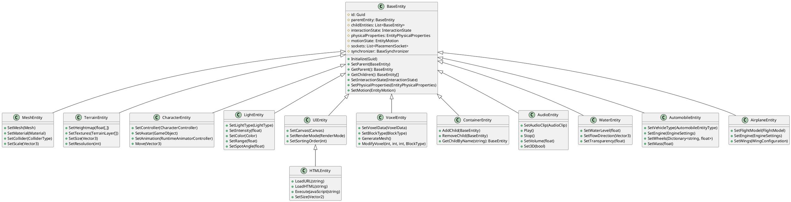
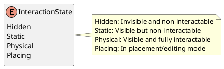
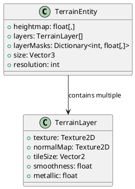
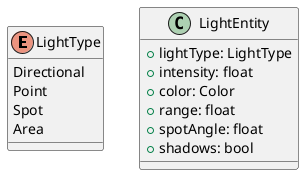
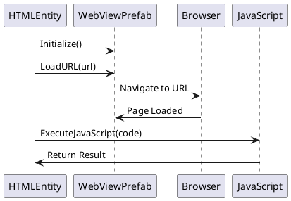
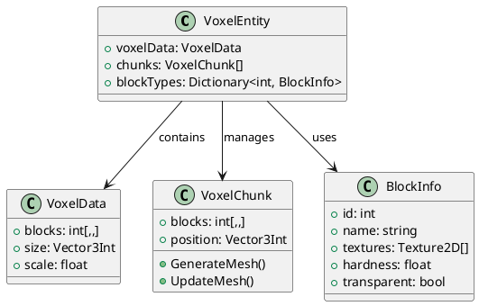
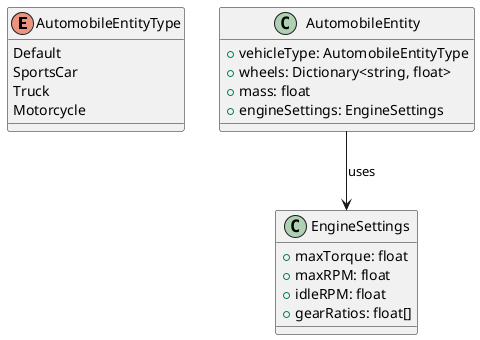
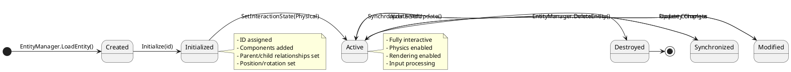
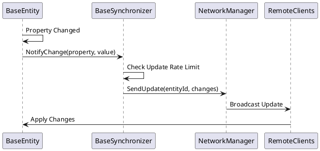

# Entity System

This document provides comprehensive documentation for the WebVerse World Engine entity system, including all supported entity types, their properties, and usage patterns.

## Overview

The entity system is the core of the WebVerse World Engine, providing a flexible and extensible framework for representing all objects in a virtual world. All entities inherit from `BaseEntity` and follow a consistent lifecycle and interaction model.

## Entity Hierarchy



## BaseEntity - Core Entity Class

All entities inherit from `BaseEntity`, which provides fundamental functionality for all world objects.

### Core Properties

```csharp
public class BaseEntity : MonoBehaviour
{
    // Unique identifier
    protected Guid id;
    
    // Hierarchy management
    protected BaseEntity parentEntity;
    protected List<BaseEntity> childEntities;
    
    // Interaction system
    protected InteractionState interactionState;
    
    // Physics properties
    protected EntityPhysicalProperties physicalProperties;
    protected EntityMotion motionState;
    
    // Placement system
    protected List<PlacementSocket> sockets;
    
    // Synchronization
    protected BaseSynchronizer synchronizer;
}
```

### Interaction States



### Physical Properties

```csharp
public struct EntityPhysicalProperties
{
    public float? angularDrag;    // Rotational drag
    public Vector3? centerOfMass; // Center of mass offset
    public float? drag;           // Linear drag  
    public bool? gravitational;   // Affected by gravity
    public float? mass;           // Object mass
}
```

### Motion State

```csharp
public struct EntityMotion
{
    public Vector3? angularVelocity; // Rotational velocity
    public Vector3? velocity;        // Linear velocity
    public bool? stationary;         // Is object stationary
}
```

## Supported Entity Types

### 1. MeshEntity - 3D Objects

Represents 3D meshes and models in the world.

**Key Features:**
- Custom mesh loading
- Material assignment
- Collider generation
- LOD support

**Usage Example:**
```csharp
// Load a mesh entity
EntityManager.LoadMeshEntity(
    mesh: customMesh,
    materials: new Material[] { material },
    position: Vector3.zero,
    rotation: Quaternion.identity,
    scale: Vector3.one,
    id: Guid.NewGuid(),
    tag: "CustomObject"
);
```

**Supported Mesh Formats:**
- Unity native meshes
- FBX models
- OBJ files
- Procedurally generated meshes

### 2. TerrainEntity - Landscape

Creates and manages terrain heightmaps with multiple texture layers.



**Usage Example:**
```csharp
// Create terrain with heightmap
float[,] heights = GenerateHeightmap(512, 512);
TerrainLayer[] layers = new TerrainLayer[] {
    CreateGrassLayer(),
    CreateRockLayer(),
    CreateSandLayer()
};

EntityManager.LoadTerrainEntity(
    length: 1000f,
    width: 1000f, 
    height: 100f,
    heights: heights,
    layers: layers,
    layerMasks: layerMasks,
    position: Vector3.zero
);
```

### 3. CharacterEntity - Avatars and NPCs

Represents characters with movement, animation, and AI capabilities.

**Key Features:**
- Character controller integration
- Animation system
- Avatar customization
- AI behavior support

**Usage Example:**
```csharp
// Load character entity
EntityManager.LoadCharacterEntity(
    avatarPrefab: characterPrefab,
    position: spawnPoint,
    rotation: Quaternion.identity,
    id: playerId,
    tag: "Player"
);
```

### 4. LightEntity - Illumination

Provides lighting for the world with various light types.



**Usage Example:**
```csharp
// Create directional light (sun)
EntityManager.LoadLightEntity(
    lightType: LightType.Directional,
    intensity: 1.0f,
    color: Color.white,
    position: Vector3.up * 100f,
    rotation: Quaternion.Euler(50f, -30f, 0f)
);
```

### 5. UIEntity - User Interface

Base class for all UI elements in the world.

**Canvas Types:**
- Screen Space Overlay
- Screen Space Camera
- World Space

**Usage Example:**
```csharp
// Create world space UI
EntityManager.LoadUIEntity(
    canvasPrefab: worldSpaceCanvasPrefab,
    renderMode: RenderMode.WorldSpace,
    position: Vector3.forward * 5f,
    rotation: Quaternion.identity,
    size: new Vector2(1920, 1080)
);
```

### 6. HTMLEntity - Web Content

Displays web pages and HTML content in the 3D world.



**Key Features:**
- Full web browser integration
- JavaScript execution
- HTML content rendering
- Interactive web elements

**Usage Example:**
```csharp
// Load web page
htmlEntity.LoadURL("https://example.com");

// Execute JavaScript
htmlEntity.ExecuteJavaScript("document.title", (result) => {
    Debug.Log($"Page title: {result}");
});

// Load HTML content
htmlEntity.LoadHTML("<html><body><h1>Hello World!</h1></body></html>");
```

### 7. VoxelEntity - Block-Based Objects

Creates block-based objects similar to Minecraft-style voxels.



**Usage Example:**
```csharp
// Create voxel structure
VoxelData voxelData = new VoxelData {
    size = new Vector3Int(16, 16, 16),
    scale = 1f
};

// Set blocks
voxelData.SetBlock(8, 0, 8, BlockType.Grass);
voxelData.SetBlock(8, 1, 8, BlockType.Stone);

EntityManager.LoadVoxelEntity(
    voxelData: voxelData,
    position: Vector3.zero,
    id: Guid.NewGuid()
);
```

### 8. Water Entities

#### WaterBodyEntity - Water Volumes

Creates bodies of water with realistic rendering and physics.

**Features:**
- Realistic water shading
- Wave simulation
- Buoyancy physics
- Flow simulation

#### WaterBlockerEntity - Water Boundaries

Invisible barriers that contain water flow.

**Usage Example:**
```csharp
// Create water body
EntityManager.LoadWaterBodyEntity(
    size: new Vector3(100f, 10f, 100f),
    position: Vector3.zero,
    waterLevel: 5f,
    transparency: 0.7f
);

// Create water blocker
EntityManager.LoadWaterBlockerEntity(
    size: new Vector3(1f, 20f, 100f),
    position: new Vector3(50f, 0f, 0f)
);
```

### 9. Vehicle Entities

#### AutomobileEntity - Ground Vehicles

Vehicles with realistic physics and controls.



#### AirplaneEntity - Aircraft

Flying vehicles with flight physics.

**Usage Example:**
```csharp
// Create automobile
Dictionary<string, float> wheels = new Dictionary<string, float> {
    {"frontLeft", 0.8f},
    {"frontRight", 0.8f}, 
    {"rearLeft", 1.0f},
    {"rearRight", 1.0f}
};

EntityManager.LoadAutomobileEntity(
    meshPrefab: carPrefab,
    wheels: wheels,
    mass: 1500f,
    vehicleType: AutomobileEntityType.Default,
    position: Vector3.zero
);
```

### 10. AudioEntity - Spatial Audio

3D positioned audio sources with spatial audio effects.

**Features:**
- 3D spatial audio
- Distance attenuation  
- Occlusion effects
- Audio streaming

**Usage Example:**
```csharp
// Create 3D audio source
EntityManager.LoadAudioEntity(
    audioClip: backgroundMusic,
    position: Vector3.zero,
    volume: 0.8f,
    spatialBlend: 1.0f, // Full 3D
    loop: true
);
```

## Entity Lifecycle



## Entity Synchronization

All entities support real-time synchronization across network connections:



## Placement System

Entities can be equipped with placement sockets for snap-to positioning:

```csharp
public class PlacementSocket : MonoBehaviour
{
    public enum SocketType
    {
        Generic,
        Wall,
        Floor,
        Ceiling,
        Custom
    }
    
    public SocketType socketType;
    public Vector3 offset;
    public Quaternion rotation;
    public float snapDistance = 1.0f;
}
```

## Performance Optimizations

### LOD System

Entities automatically adjust their level of detail based on distance from camera:

- **LOD 0**: Full detail (close range)
- **LOD 1**: Medium detail (medium range)  
- **LOD 2**: Low detail (far range)
- **LOD 3**: Billboard/impostor (very far range)

### Culling System

- **Frustum Culling**: Hide objects outside camera view
- **Occlusion Culling**: Hide objects blocked by other objects
- **Distance Culling**: Hide very distant objects

### Batching

Similar entities are automatically batched to reduce draw calls:

- **Static Batching**: For non-moving objects
- **Dynamic Batching**: For moving objects with same material
- **GPU Instancing**: For many identical objects

## Best Practices

### Entity Creation

1. **Use Factory Methods**: Always create entities through EntityManager
2. **Set Properties Before Activation**: Configure entity before making it Physical
3. **Manage Hierarchy**: Properly set parent-child relationships
4. **Handle Cleanup**: Always destroy entities when no longer needed

### Performance

1. **Limit Active Entities**: Keep active entity count reasonable
2. **Use Object Pooling**: For frequently created/destroyed entities
3. **Batch Updates**: Group multiple property changes
4. **Optimize Materials**: Share materials between similar entities

### Synchronization

1. **Limit Update Frequency**: Don't synchronize every frame
2. **Synchronize Only Changes**: Use dirty flagging
3. **Prioritize Updates**: More important entities update more frequently
4. **Handle Network Lag**: Implement lag compensation

This entity system provides a powerful and flexible foundation for creating rich, interactive virtual worlds with comprehensive support for all types of objects and behaviors.