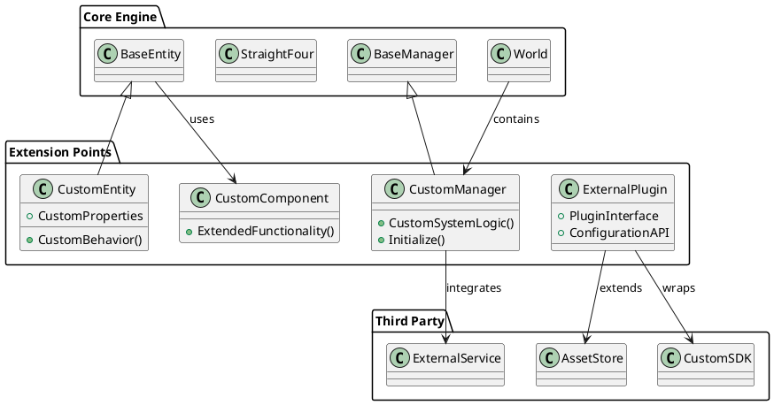

# Extensibility

This document explains how to extend and customize the WebVerse World Engine with custom components, entity types, managers, and integrations.

## Overview

The WebVerse World Engine is designed with extensibility in mind. You can extend the engine at multiple levels:

1. **Custom Entity Types** - Create new types of world objects
2. **Custom Managers** - Add new system-level functionality
3. **Custom Components** - Extend existing entities with new behaviors
4. **Plugin System** - Create reusable extension packages
5. **External Integrations** - Connect with third-party systems

## Architecture for Extensions



## Creating Custom Entity Types

### Step 1: Define Custom Entity Class

```csharp
using UnityEngine;
using FiveSQD.StraightFour.Entity;

namespace MyProject.Entities
{
    /// <summary>
    /// Custom particle system entity for special effects
    /// </summary>
    public class ParticleSystemEntity : BaseEntity
    {
        [Header("Particle System Settings")]
        public ParticleSystem particleSystem;
        public bool autoPlay = true;
        public float lifetime = 5f;
        
        [Header("Custom Properties")]
        public Color startColor = Color.white;
        public Vector3 emissionDirection = Vector3.up;
        public float emissionRate = 100f;
        public float particleSize = 1f;
        
        private float creationTime;
        
        public override void Initialize(System.Guid idToSet)
        {
            base.Initialize(idToSet);
            
            creationTime = Time.time;
            SetupParticleSystem();
            
            if (autoPlay)
            {
                PlayEffect();
            }
        }
        
        private void SetupParticleSystem()
        {
            if (particleSystem == null)
            {
                particleSystem = gameObject.AddComponent<ParticleSystem>();
            }
            
            // Configure particle system
            var main = particleSystem.main;
            main.startColor = startColor;
            main.startSize = particleSize;
            main.startLifetime = lifetime;
            
            var emission = particleSystem.emission;
            emission.rateOverTime = emissionRate;
            
            var shape = particleSystem.shape;
            shape.enabled = true;
            shape.shapeType = ParticleSystemShapeType.Circle;
            
            var velocityOverLifetime = particleSystem.velocityOverLifetime;
            velocityOverLifetime.enabled = true;
            velocityOverLifetime.space = ParticleSystemSimulationSpace.Local;
            velocityOverLifetime.radial = new ParticleSystem.MinMaxCurve(0f);
        }
        
        public void PlayEffect()
        {
            if (particleSystem != null)
            {
                particleSystem.Play();
                Debug.Log($"Particle effect started: {id}");
            }
        }
        
        public void StopEffect()
        {
            if (particleSystem != null)
            {
                particleSystem.Stop();
                Debug.Log($"Particle effect stopped: {id}");
            }
        }
        
        public bool SetStartColor(Color color, bool synchronize = true)
        {
            startColor = color;
            
            if (particleSystem != null)
            {
                var main = particleSystem.main;
                main.startColor = color;
            }
            
            if (synchronize && synchronizer != null)
            {
                synchronizer.SendUpdate("startColor", color);
            }
            
            return true;
        }
        
        public bool SetEmissionRate(float rate, bool synchronize = true)
        {
            emissionRate = rate;
            
            if (particleSystem != null)
            {
                var emission = particleSystem.emission;
                emission.rateOverTime = rate;
            }
            
            if (synchronize && synchronizer != null)
            {
                synchronizer.SendUpdate("emissionRate", rate);
            }
            
            return true;
        }
        
        private void Update()
        {
            // Auto-destroy after lifetime
            if (autoPlay && Time.time - creationTime > lifetime + 2f)
            {
                var entityManager = StraightFour.ActiveWorld?.entityManager;
                entityManager?.DeleteEntity(id);
            }
        }
    }
}
```

### Step 2: Extend EntityManager

```csharp
using UnityEngine;
using FiveSQD.StraightFour.Entity;
using MyProject.Entities;

namespace MyProject.Extensions
{
    public static class EntityManagerExtensions
    {
        /// <summary>
        /// Load a particle system entity
        /// </summary>
        public static bool LoadParticleSystemEntity(this EntityManager entityManager,
            BaseEntity parent, Vector3 position, Quaternion rotation,
            Color startColor, float emissionRate, float particleSize,
            float lifetime = 5f, bool autoPlay = true,
            System.Guid? id = null, string tag = null,
            System.Action onLoaded = null)
        {
            try
            {
                System.Guid entityId = id ?? System.Guid.NewGuid();
                
                // Create GameObject
                GameObject particleGO = new GameObject($"ParticleSystemEntity_{entityId}");
                particleGO.transform.position = position;
                particleGO.transform.rotation = rotation;
                
                if (parent != null)
                {
                    particleGO.transform.SetParent(parent.transform);
                }
                
                // Add custom entity component
                ParticleSystemEntity particleEntity = particleGO.AddComponent<ParticleSystemEntity>();
                particleEntity.startColor = startColor;
                particleEntity.emissionRate = emissionRate;
                particleEntity.particleSize = particleSize;
                particleEntity.lifetime = lifetime;
                particleEntity.autoPlay = autoPlay;
                
                if (!string.IsNullOrEmpty(tag))
                {
                    particleGO.tag = tag;
                }
                
                // Initialize the entity
                particleEntity.Initialize(entityId);
                
                // Register with entity manager (access private field through reflection)
                var entitiesField = typeof(EntityManager).GetField("entities", 
                    System.Reflection.BindingFlags.NonPublic | System.Reflection.BindingFlags.Instance);
                var entities = entitiesField.GetValue(entityManager) as System.Collections.Generic.Dictionary<System.Guid, BaseEntity>;
                entities[entityId] = particleEntity;
                
                onLoaded?.Invoke();
                
                return true;
            }
            catch (System.Exception e)
            {
                Debug.LogError($"Failed to load particle system entity: {e.Message}");
                return false;
            }
        }
    }
}
```

### Step 3: Usage Example

```csharp
using UnityEngine;
using MyProject.Extensions;

public class ParticleEffectDemo : MonoBehaviour
{
    void Start()
    {
        var entityManager = StraightFour.ActiveWorld?.entityManager;
        if (entityManager == null) return;
        
        // Create explosion effect
        entityManager.LoadParticleSystemEntity(
            parent: null,
            position: Vector3.zero,
            rotation: Quaternion.identity,
            startColor: Color.red,
            emissionRate: 200f,
            particleSize: 0.5f,
            lifetime: 3f,
            autoPlay: true,
            tag: "ExplosionEffect",
            onLoaded: () => Debug.Log("Explosion effect created!")
        );
        
        // Create magic sparkles
        entityManager.LoadParticleSystemEntity(
            parent: null,
            position: new Vector3(5, 2, 0),
            rotation: Quaternion.identity,
            startColor: Color.cyan,
            emissionRate: 50f,
            particleSize: 0.2f,
            lifetime: 10f,
            autoPlay: true,
            tag: "MagicSparkles"
        );
    }
}
```

## Creating Custom Managers

### Step 1: Define Custom Manager

```csharp
using UnityEngine;
using FiveSQD.StraightFour.Utilities;
using System.Collections.Generic;

namespace MyProject.Managers
{
    /// <summary>
    /// Manages weather and environmental effects
    /// </summary>
    public class WeatherManager : BaseManager
    {
        [Header("Weather Settings")]
        public WeatherType currentWeather = WeatherType.Clear;
        public float transitionDuration = 5f;
        
        [Header("Weather Effects")]
        public ParticleSystem rainEffect;
        public ParticleSystem snowEffect;
        public ParticleSystem fogEffect;
        
        [Header("Lighting")]
        public Light sunLight;
        public Color clearSkyColor = Color.blue;
        public Color stormySkyColor = Color.gray;
        
        private WeatherType targetWeather;
        private float transitionProgress = 0f;
        private bool isTransitioning = false;
        
        public enum WeatherType
        {
            Clear,
            Cloudy,
            Rainy,
            Stormy,
            Snowy,
            Foggy
        }
        
        public override void Initialize()
        {
            LogSystem.LogInfo("[WeatherManager] Initializing weather system");
            
            // Setup weather effects
            SetupWeatherEffects();
            
            // Set initial weather
            SetWeather(currentWeather, false);
            
            LogSystem.LogInfo("[WeatherManager] Weather system initialized");
        }
        
        private void SetupWeatherEffects()
        {
            // Create weather effect objects if they don't exist
            if (rainEffect == null)
            {
                rainEffect = CreateWeatherEffect("Rain", Color.blue);
            }
            
            if (snowEffect == null)
            {
                snowEffect = CreateWeatherEffect("Snow", Color.white);
            }
            
            if (fogEffect == null)
            {
                fogEffect = CreateWeatherEffect("Fog", Color.gray);
            }
            
            // Find sun light
            if (sunLight == null)
            {
                sunLight = FindObjectOfType<Light>();
            }
        }
        
        private ParticleSystem CreateWeatherEffect(string name, Color color)
        {
            GameObject effectGO = new GameObject($"Weather_{name}");
            effectGO.transform.SetParent(transform);
            
            ParticleSystem ps = effectGO.AddComponent<ParticleSystem>();
            
            // Configure particle system for weather
            var main = ps.main;
            main.startColor = color;
            main.startLifetime = 5f;
            main.startSize = 0.1f;
            main.maxParticles = 1000;
            
            var emission = ps.emission;
            emission.rateOverTime = 100f;
            
            var shape = ps.shape;
            shape.enabled = true;
            shape.shapeType = ParticleSystemShapeType.Box;
            shape.scale = new Vector3(50f, 1f, 50f);
            
            // Stop by default
            ps.Stop();
            
            return ps;
        }
        
        public void SetWeather(WeatherType newWeather, bool useTransition = true)
        {
            if (newWeather == currentWeather && !isTransitioning) return;
            
            targetWeather = newWeather;
            
            if (useTransition)
            {
                StartTransition();
            }
            else
            {
                ApplyWeatherImmediate(newWeather);
                currentWeather = newWeather;
            }
            
            LogSystem.LogInfo($"[WeatherManager] Weather changing to {newWeather}");
        }
        
        private void StartTransition()
        {
            isTransitioning = true;
            transitionProgress = 0f;
            
            StartCoroutine(TransitionWeather());
        }
        
        private System.Collections.IEnumerator TransitionWeather()
        {
            WeatherType startWeather = currentWeather;
            
            while (transitionProgress < 1f)
            {
                transitionProgress += Time.deltaTime / transitionDuration;
                transitionProgress = Mathf.Clamp01(transitionProgress);
                
                // Interpolate weather effects
                InterpolateWeather(startWeather, targetWeather, transitionProgress);
                
                yield return null;
            }
            
            // Complete transition
            ApplyWeatherImmediate(targetWeather);
            currentWeather = targetWeather;
            isTransitioning = false;
            
            LogSystem.LogInfo($"[WeatherManager] Weather transition to {targetWeather} complete");
        }
        
        private void InterpolateWeather(WeatherType from, WeatherType to, float progress)
        {
            // Stop all effects first
            StopAllWeatherEffects();
            
            // Interpolate lighting
            if (sunLight != null)
            {
                float fromIntensity = GetWeatherLightIntensity(from);
                float toIntensity = GetWeatherLightIntensity(to);
                sunLight.intensity = Mathf.Lerp(fromIntensity, toIntensity, progress);
                
                Color fromColor = GetWeatherLightColor(from);
                Color toColor = GetWeatherLightColor(to);
                sunLight.color = Color.Lerp(fromColor, toColor, progress);
            }
            
            // Start target weather effects if transition is far enough
            if (progress > 0.5f)
            {
                StartWeatherEffect(to, progress);
            }
        }
        
        private void ApplyWeatherImmediate(WeatherType weather)
        {
            StopAllWeatherEffects();
            
            // Set lighting
            if (sunLight != null)
            {
                sunLight.intensity = GetWeatherLightIntensity(weather);
                sunLight.color = GetWeatherLightColor(weather);
            }
            
            // Start weather effects
            StartWeatherEffect(weather, 1f);
        }
        
        private void StopAllWeatherEffects()
        {
            if (rainEffect != null) rainEffect.Stop();
            if (snowEffect != null) snowEffect.Stop();
            if (fogEffect != null) fogEffect.Stop();
        }
        
        private void StartWeatherEffect(WeatherType weather, float intensity)
        {
            switch (weather)
            {
                case WeatherType.Rainy:
                case WeatherType.Stormy:
                    if (rainEffect != null)
                    {
                        var emission = rainEffect.emission;
                        emission.rateOverTime = 100f * intensity;
                        rainEffect.Play();
                    }
                    break;
                    
                case WeatherType.Snowy:
                    if (snowEffect != null)
                    {
                        var emission = snowEffect.emission;
                        emission.rateOverTime = 50f * intensity;
                        snowEffect.Play();
                    }
                    break;
                    
                case WeatherType.Foggy:
                    if (fogEffect != null)
                    {
                        var emission = fogEffect.emission;
                        emission.rateOverTime = 20f * intensity;
                        fogEffect.Play();
                    }
                    break;
            }
        }
        
        private float GetWeatherLightIntensity(WeatherType weather)
        {
            switch (weather)
            {
                case WeatherType.Clear: return 1.0f;
                case WeatherType.Cloudy: return 0.7f;
                case WeatherType.Rainy: return 0.5f;
                case WeatherType.Stormy: return 0.3f;
                case WeatherType.Snowy: return 0.6f;
                case WeatherType.Foggy: return 0.4f;
                default: return 1.0f;
            }
        }
        
        private Color GetWeatherLightColor(WeatherType weather)
        {
            switch (weather)
            {
                case WeatherType.Clear: return Color.white;
                case WeatherType.Cloudy: return new Color(0.9f, 0.9f, 1f);
                case WeatherType.Rainy: return new Color(0.7f, 0.8f, 1f);
                case WeatherType.Stormy: return new Color(0.6f, 0.6f, 0.8f);
                case WeatherType.Snowy: return new Color(0.9f, 0.95f, 1f);
                case WeatherType.Foggy: return new Color(0.8f, 0.8f, 0.9f);
                default: return Color.white;
            }
        }
        
        // Public API for external control
        public void StartRain() => SetWeather(WeatherType.Rainy);
        public void StartSnow() => SetWeather(WeatherType.Snowy);
        public void ClearWeather() => SetWeather(WeatherType.Clear);
        public void StartStorm() => SetWeather(WeatherType.Stormy);
        
        public WeatherType GetCurrentWeather() => currentWeather;
        public bool IsTransitioning() => isTransitioning;
    }
}
```

### Step 2: Register Custom Manager

```csharp
using UnityEngine;
using FiveSQD.StraightFour.World;
using MyProject.Managers;

namespace MyProject.Extensions
{
    /// <summary>
    /// Extension to add custom managers to World
    /// </summary>
    public static class WorldExtensions
    {
        public static WeatherManager GetWeatherManager(this World world)
        {
            return world.GetComponent<WeatherManager>();
        }
        
        public static void AddWeatherManager(this World world)
        {
            if (world.GetComponent<WeatherManager>() == null)
            {
                WeatherManager weatherManager = world.gameObject.AddComponent<WeatherManager>();
                weatherManager.Initialize();
            }
        }
    }
}

// Usage in world initialization
public class CustomWorldSetup : MonoBehaviour
{
    void Start()
    {
        var world = StraightFour.ActiveWorld;
        if (world != null)
        {
            // Add custom weather manager
            world.AddWeatherManager();
            
            // Use the weather manager
            var weatherManager = world.GetWeatherManager();
            weatherManager.StartRain();
        }
    }
}
```

## Custom Components

### Behavior Extension Component

```csharp
using UnityEngine;
using FiveSQD.StraightFour.Entity;

namespace MyProject.Components
{
    /// <summary>
    /// Adds interactive behavior to any entity
    /// </summary>
    public class InteractiveBehavior : MonoBehaviour
    {
        [Header("Interaction Settings")]
        public float interactionRange = 5f;
        public LayerMask interactionLayers = -1;
        public bool requireLineOfSight = true;
        
        [Header("Visual Feedback")]
        public Material highlightMaterial;
        public float highlightIntensity = 1.5f;
        
        [Header("Audio")]
        public AudioClip hoverSound;
        public AudioClip clickSound;
        
        public System.Action<BaseEntity> OnEntityHover;
        public System.Action<BaseEntity> OnEntityClick;
        public System.Action<BaseEntity> OnEntityHoverExit;
        
        private BaseEntity entity;
        private Camera playerCamera;
        private AudioSource audioSource;
        private Material originalMaterial;
        private Renderer entityRenderer;
        private bool isHighlighted = false;
        
        void Start()
        {
            entity = GetComponent<BaseEntity>();
            playerCamera = Camera.main;
            
            // Setup audio
            audioSource = gameObject.AddComponent<AudioSource>();
            audioSource.spatialBlend = 1f; // 3D sound
            audioSource.playOnAwake = false;
            
            // Get renderer for highlighting
            entityRenderer = GetComponent<Renderer>();
            if (entityRenderer != null)
            {
                originalMaterial = entityRenderer.material;
            }
        }
        
        void Update()
        {
            CheckForPlayerInteraction();
        }
        
        void CheckForPlayerInteraction()
        {
            if (playerCamera == null || entity == null) return;
            
            float distanceToPlayer = Vector3.Distance(transform.position, playerCamera.transform.position);
            
            if (distanceToPlayer <= interactionRange)
            {
                if (IsPlayerLookingAt() && (!requireLineOfSight || HasLineOfSight()))
                {
                    if (!isHighlighted)
                    {
                        OnHoverEnter();
                    }
                    
                    if (Input.GetMouseButtonDown(0))
                    {
                        OnClick();
                    }
                }
                else if (isHighlighted)
                {
                    OnHoverExit();
                }
            }
            else if (isHighlighted)
            {
                OnHoverExit();
            }
        }
        
        bool IsPlayerLookingAt()
        {
            Ray ray = new Ray(playerCamera.transform.position, playerCamera.transform.forward);
            
            if (Physics.Raycast(ray, out RaycastHit hit, interactionRange, interactionLayers))
            {
                return hit.collider.gameObject == gameObject;
            }
            
            return false;
        }
        
        bool HasLineOfSight()
        {
            Vector3 directionToPlayer = (playerCamera.transform.position - transform.position).normalized;
            
            if (Physics.Raycast(transform.position, directionToPlayer, out RaycastHit hit, interactionRange))
            {
                return hit.collider.CompareTag("Player") || hit.collider.name.Contains("Camera");
            }
            
            return true; // No obstacles
        }
        
        void OnHoverEnter()
        {
            isHighlighted = true;
            
            // Apply highlight material
            if (entityRenderer != null && highlightMaterial != null)
            {
                entityRenderer.material = highlightMaterial;
            }
            
            // Play hover sound
            if (hoverSound != null && audioSource != null)
            {
                audioSource.PlayOneShot(hoverSound);
            }
            
            // Notify subscribers
            OnEntityHover?.Invoke(entity);
            
            // Change entity interaction state
            if (entity != null)
            {
                entity.SetInteractionState(InteractionState.Static);
            }
        }
        
        void OnClick()
        {
            // Play click sound
            if (clickSound != null && audioSource != null)
            {
                audioSource.PlayOneShot(clickSound);
            }
            
            // Notify subscribers
            OnEntityClick?.Invoke(entity);
            
            // Trigger animation
            StartCoroutine(ClickAnimation());
        }
        
        void OnHoverExit()
        {
            isHighlighted = false;
            
            // Restore original material
            if (entityRenderer != null && originalMaterial != null)
            {
                entityRenderer.material = originalMaterial;
            }
            
            // Notify subscribers
            OnEntityHoverExit?.Invoke(entity);
            
            // Reset entity interaction state
            if (entity != null)
            {
                entity.SetInteractionState(InteractionState.Physical);
            }
        }
        
        System.Collections.IEnumerator ClickAnimation()
        {
            Vector3 originalScale = transform.localScale;
            Vector3 targetScale = originalScale * 1.1f;
            
            // Scale up
            float duration = 0.1f;
            float elapsed = 0f;
            
            while (elapsed < duration)
            {
                float progress = elapsed / duration;
                transform.localScale = Vector3.Lerp(originalScale, targetScale, progress);
                elapsed += Time.deltaTime;
                yield return null;
            }
            
            // Scale back down
            elapsed = 0f;
            while (elapsed < duration)
            {
                float progress = elapsed / duration;
                transform.localScale = Vector3.Lerp(targetScale, originalScale, progress);
                elapsed += Time.deltaTime;
                yield return null;
            }
            
            transform.localScale = originalScale;
        }
        
        void OnDrawGizmosSelected()
        {
            // Draw interaction range
            Gizmos.color = Color.yellow;
            Gizmos.DrawWireSphere(transform.position, interactionRange);
        }
    }
}
```

## Plugin System

### Plugin Interface

```csharp
using UnityEngine;

namespace MyProject.PluginSystem
{
    public interface IWorldEnginePlugin
    {
        string PluginName { get; }
        string Version { get; }
        string Author { get; }
        
        bool Initialize(PluginContext context);
        void Shutdown();
        void Update(float deltaTime);
        
        bool IsCompatible(string engineVersion);
        PluginInfo GetPluginInfo();
    }
    
    [System.Serializable]
    public class PluginInfo
    {
        public string name;
        public string version;
        public string author;
        public string description;
        public string[] dependencies;
        public string minimumEngineVersion;
    }
    
    public class PluginContext
    {
        public StraightFour engine;
        public World.World world;
        public Transform pluginContainer;
        
        public PluginContext(StraightFour engine, World.World world, Transform container)
        {
            this.engine = engine;
            this.world = world;
            this.pluginContainer = container;
        }
    }
}
```

### Sample Plugin Implementation

```csharp
using UnityEngine;
using MyProject.PluginSystem;

namespace MyProject.Plugins
{
    /// <summary>
    /// Sample plugin that adds advanced lighting effects
    /// </summary>
    public class AdvancedLightingPlugin : MonoBehaviour, IWorldEnginePlugin
    {
        public string PluginName => "Advanced Lighting System";
        public string Version => "1.0.0";
        public string Author => "MyProject Team";
        
        [Header("Lighting Settings")]
        public bool enableVolumetricLighting = true;
        public bool enableDynamicShadows = true;
        public bool enableLightScattering = true;
        
        private PluginContext context;
        private GameObject volumetricLightingGO;
        private Light[] dynamicLights;
        
        public bool Initialize(PluginContext context)
        {
            this.context = context;
            
            try
            {
                Debug.Log($"[{PluginName}] Initializing...");
                
                SetupVolumetricLighting();
                SetupDynamicShadows();
                SetupLightScattering();
                
                Debug.Log($"[{PluginName}] Initialized successfully");
                return true;
            }
            catch (System.Exception e)
            {
                Debug.LogError($"[{PluginName}] Failed to initialize: {e.Message}");
                return false;
            }
        }
        
        public void Shutdown()
        {
            Debug.Log($"[{PluginName}] Shutting down...");
            
            if (volumetricLightingGO != null)
            {
                DestroyImmediate(volumetricLightingGO);
            }
        }
        
        public void Update(float deltaTime)
        {
            UpdateDynamicLighting(deltaTime);
        }
        
        public bool IsCompatible(string engineVersion)
        {
            // Simple version check
            return true; // Compatible with all versions for this example
        }
        
        public PluginInfo GetPluginInfo()
        {
            return new PluginInfo
            {
                name = PluginName,
                version = Version,
                author = Author,
                description = "Adds advanced lighting effects including volumetric lighting and dynamic shadows",
                dependencies = new string[] { },
                minimumEngineVersion = "1.0.0"
            };
        }
        
        private void SetupVolumetricLighting()
        {
            if (!enableVolumetricLighting) return;
            
            volumetricLightingGO = new GameObject("VolumetricLighting");
            volumetricLightingGO.transform.SetParent(context.pluginContainer);
            
            // Add volumetric lighting component (would be a custom implementation)
            var volumetricComponent = volumetricLightingGO.AddComponent<VolumetricLighting>();
            volumetricComponent.intensity = 0.5f;
            volumetricComponent.scatteringCoefficient = 0.1f;
        }
        
        private void SetupDynamicShadows()
        {
            if (!enableDynamicShadows) return;
            
            // Find all lights in the scene and enable dynamic shadows
            dynamicLights = FindObjectsOfType<Light>();
            
            foreach (Light light in dynamicLights)
            {
                light.shadows = LightShadows.Soft;
                light.shadowStrength = 0.8f;
                light.shadowResolution = LightShadowResolution.High;
            }
        }
        
        private void SetupLightScattering()
        {
            if (!enableLightScattering) return;
            
            // Setup atmospheric scattering
            var camera = context.world?.cameraManager?.cam;
            if (camera != null)
            {
                var scatteringComponent = camera.gameObject.AddComponent<AtmosphericScattering>();
                scatteringComponent.sunIntensity = 20f;
                scatteringComponent.scatteringR = 5.8f;
                scatteringComponent.scatteringG = 13.5f;
                scatteringComponent.scatteringB = 33.1f;
            }
        }
        
        private void UpdateDynamicLighting(float deltaTime)
        {
            // Update dynamic lighting effects
            if (enableVolumetricLighting && volumetricLightingGO != null)
            {
                // Animate volumetric lighting
                var volumetric = volumetricLightingGO.GetComponent<VolumetricLighting>();
                if (volumetric != null)
                {
                    volumetric.intensity = 0.5f + Mathf.Sin(Time.time) * 0.1f;
                }
            }
        }
    }
    
    // Placeholder components - would be implemented separately
    public class VolumetricLighting : MonoBehaviour
    {
        public float intensity = 1f;
        public float scatteringCoefficient = 0.1f;
    }
    
    public class AtmosphericScattering : MonoBehaviour
    {
        public float sunIntensity = 20f;
        public float scatteringR = 5.8f;
        public float scatteringG = 13.5f;
        public float scatteringB = 33.1f;
    }
}
```

### Plugin Manager

```csharp
using UnityEngine;
using System.Collections.Generic;
using System.Linq;
using MyProject.PluginSystem;

namespace MyProject.Managers
{
    /// <summary>
    /// Manages loading and lifecycle of plugins
    /// </summary>
    public class PluginManager : MonoBehaviour
    {
        [Header("Plugin Settings")]
        public bool autoLoadPlugins = true;
        public string pluginDirectory = "Plugins";
        
        private List<IWorldEnginePlugin> loadedPlugins = new List<IWorldEnginePlugin>();
        private PluginContext pluginContext;
        private Transform pluginContainer;
        
        void Start()
        {
            SetupPluginSystem();
            
            if (autoLoadPlugins)
            {
                LoadAllPlugins();
            }
        }
        
        void Update()
        {
            // Update all loaded plugins
            foreach (var plugin in loadedPlugins)
            {
                try
                {
                    plugin.Update(Time.deltaTime);
                }
                catch (System.Exception e)
                {
                    Debug.LogError($"Plugin {plugin.PluginName} update failed: {e.Message}");
                }
            }
        }
        
        void OnDestroy()
        {
            ShutdownAllPlugins();
        }
        
        private void SetupPluginSystem()
        {
            // Create plugin container
            pluginContainer = new GameObject("PluginContainer").transform;
            pluginContainer.SetParent(transform);
            
            // Setup plugin context
            var world = StraightFour.ActiveWorld;
            var engine = FindObjectOfType<StraightFour>();
            
            pluginContext = new PluginContext(engine, world, pluginContainer);
        }
        
        public void LoadAllPlugins()
        {
            // Find all plugin components in the scene
            var pluginComponents = FindObjectsOfType<MonoBehaviour>()
                .Where(mb => mb is IWorldEnginePlugin)
                .Cast<IWorldEnginePlugin>()
                .ToList();
            
            foreach (var plugin in pluginComponents)
            {
                LoadPlugin(plugin);
            }
        }
        
        public bool LoadPlugin(IWorldEnginePlugin plugin)
        {
            if (loadedPlugins.Contains(plugin))
            {
                Debug.LogWarning($"Plugin {plugin.PluginName} is already loaded");
                return false;
            }
            
            if (!plugin.IsCompatible(GetEngineVersion()))
            {
                Debug.LogError($"Plugin {plugin.PluginName} is not compatible with engine version {GetEngineVersion()}");
                return false;
            }
            
            if (plugin.Initialize(pluginContext))
            {
                loadedPlugins.Add(plugin);
                Debug.Log($"Plugin {plugin.PluginName} v{plugin.Version} loaded successfully");
                return true;
            }
            else
            {
                Debug.LogError($"Failed to load plugin {plugin.PluginName}");
                return false;
            }
        }
        
        public bool UnloadPlugin(string pluginName)
        {
            var plugin = loadedPlugins.FirstOrDefault(p => p.PluginName == pluginName);
            if (plugin == null)
            {
                Debug.LogWarning($"Plugin {pluginName} not found");
                return false;
            }
            
            return UnloadPlugin(plugin);
        }
        
        public bool UnloadPlugin(IWorldEnginePlugin plugin)
        {
            if (!loadedPlugins.Contains(plugin))
            {
                Debug.LogWarning($"Plugin {plugin.PluginName} is not loaded");
                return false;
            }
            
            try
            {
                plugin.Shutdown();
                loadedPlugins.Remove(plugin);
                Debug.Log($"Plugin {plugin.PluginName} unloaded successfully");
                return true;
            }
            catch (System.Exception e)
            {
                Debug.LogError($"Failed to unload plugin {plugin.PluginName}: {e.Message}");
                return false;
            }
        }
        
        public void ShutdownAllPlugins()
        {
            var pluginsToUnload = loadedPlugins.ToList();
            
            foreach (var plugin in pluginsToUnload)
            {
                UnloadPlugin(plugin);
            }
            
            loadedPlugins.Clear();
        }
        
        public List<PluginInfo> GetLoadedPluginInfo()
        {
            return loadedPlugins.Select(p => p.GetPluginInfo()).ToList();
        }
        
        public IWorldEnginePlugin GetPlugin(string pluginName)
        {
            return loadedPlugins.FirstOrDefault(p => p.PluginName == pluginName);
        }
        
        public T GetPlugin<T>() where T : class, IWorldEnginePlugin
        {
            return loadedPlugins.OfType<T>().FirstOrDefault();
        }
        
        private string GetEngineVersion()
        {
            // Return current engine version
            return "1.0.0";
        }
    }
}
```

## External Integrations

### Third-Party Service Integration

```csharp
using UnityEngine;
using System.Collections;
using System.Collections.Generic;

namespace MyProject.Integrations
{
    /// <summary>
    /// Integration with external analytics service
    /// </summary>
    public class AnalyticsIntegration : MonoBehaviour
    {
        [Header("Analytics Settings")]
        public string apiKey = "";
        public string apiUrl = "https://api.analytics.com";
        public bool enableAnalytics = true;
        public float batchInterval = 30f;
        
        private Queue<AnalyticsEvent> eventQueue = new Queue<AnalyticsEvent>();
        private Coroutine batchingCoroutine;
        
        [System.Serializable]
        public class AnalyticsEvent
        {
            public string eventType;
            public string entityId;
            public Vector3 position;
            public float timestamp;
            public Dictionary<string, object> properties;
            
            public AnalyticsEvent(string type, string id, Vector3 pos)
            {
                eventType = type;
                entityId = id;
                position = pos;
                timestamp = Time.time;
                properties = new Dictionary<string, object>();
            }
        }
        
        void Start()
        {
            if (enableAnalytics)
            {
                InitializeAnalytics();
            }
        }
        
        void InitializeAnalytics()
        {
            // Register for world events
            var world = StraightFour.ActiveWorld;
            if (world != null)
            {
                // Subscribe to entity events
                SubscribeToEntityEvents(world.entityManager);
            }
            
            // Start batching coroutine
            if (batchingCoroutine != null)
            {
                StopCoroutine(batchingCoroutine);
            }
            batchingCoroutine = StartCoroutine(BatchEvents());
            
            Debug.Log("[Analytics] Analytics integration initialized");
        }
        
        void SubscribeToEntityEvents(EntityManager entityManager)
        {
            // This would require extending the EntityManager to support events
            // For demonstration purposes, we'll show how it would work
            
            /*
            entityManager.OnEntityCreated += OnEntityCreated;
            entityManager.OnEntityDestroyed += OnEntityDestroyed;
            entityManager.OnEntityInteracted += OnEntityInteracted;
            */
        }
        
        public void TrackEvent(string eventType, string entityId, Vector3 position, Dictionary<string, object> properties = null)
        {
            if (!enableAnalytics) return;
            
            var analyticsEvent = new AnalyticsEvent(eventType, entityId, position);
            
            if (properties != null)
            {
                foreach (var kvp in properties)
                {
                    analyticsEvent.properties[kvp.Key] = kvp.Value;
                }
            }
            
            eventQueue.Enqueue(analyticsEvent);
        }
        
        void OnEntityCreated(BaseEntity entity)
        {
            TrackEvent("entity_created", entity.id.ToString(), entity.transform.position, new Dictionary<string, object>
            {
                { "entity_type", entity.GetType().Name },
                { "tag", entity.tag }
            });
        }
        
        void OnEntityDestroyed(BaseEntity entity)
        {
            TrackEvent("entity_destroyed", entity.id.ToString(), entity.transform.position, new Dictionary<string, object>
            {
                { "entity_type", entity.GetType().Name },
                { "lifetime", Time.time - entity.creationTime }
            });
        }
        
        void OnEntityInteracted(BaseEntity entity, string interactionType)
        {
            TrackEvent("entity_interaction", entity.id.ToString(), entity.transform.position, new Dictionary<string, object>
            {
                { "interaction_type", interactionType },
                { "entity_type", entity.GetType().Name }
            });
        }
        
        IEnumerator BatchEvents()
        {
            while (true)
            {
                yield return new WaitForSeconds(batchInterval);
                
                if (eventQueue.Count > 0)
                {
                    SendEventBatch();
                }
            }
        }
        
        void SendEventBatch()
        {
            var events = new List<AnalyticsEvent>();
            
            // Dequeue all events
            while (eventQueue.Count > 0)
            {
                events.Add(eventQueue.Dequeue());
            }
            
            if (events.Count == 0) return;
            
            // Convert to JSON and send
            string jsonData = JsonUtility.ToJson(new { events = events });
            StartCoroutine(SendToAPI(jsonData));
        }
        
        IEnumerator SendToAPI(string jsonData)
        {
            using (UnityEngine.Networking.UnityWebRequest request = 
                   UnityEngine.Networking.UnityWebRequest.Post(apiUrl, jsonData))
            {
                request.SetRequestHeader("Content-Type", "application/json");
                request.SetRequestHeader("Authorization", $"Bearer {apiKey}");
                
                yield return request.SendWebRequest();
                
                if (request.result == UnityEngine.Networking.UnityWebRequest.Result.Success)
                {
                    Debug.Log($"[Analytics] Sent {jsonData.Length} bytes of analytics data");
                }
                else
                {
                    Debug.LogError($"[Analytics] Failed to send data: {request.error}");
                    
                    // Could implement retry logic here
                }
            }
        }
        
        void OnDestroy()
        {
            if (batchingCoroutine != null)
            {
                StopCoroutine(batchingCoroutine);
            }
            
            // Send any remaining events
            if (eventQueue.Count > 0)
            {
                SendEventBatch();
            }
        }
    }
}
```

## Best Practices for Extensions

### Design Principles

1. **Follow Single Responsibility**: Each extension should have one clear purpose
2. **Use Composition over Inheritance**: Prefer components over deep inheritance hierarchies  
3. **Maintain Backward Compatibility**: Don't break existing functionality
4. **Handle Errors Gracefully**: Extensions should fail safely without crashing the engine
5. **Document Your Extensions**: Provide clear documentation and examples

### Performance Considerations

1. **Avoid Heavy Operations in Update()**: Use coroutines or frame distribution
2. **Pool Objects**: Reuse objects instead of frequent creation/destruction
3. **Cache References**: Don't use Find methods in hot paths
4. **Profile Your Extensions**: Measure performance impact

### Integration Guidelines

1. **Use Proper Namespaces**: Avoid conflicts with core engine code
2. **Follow Naming Conventions**: Use consistent naming patterns
3. **Provide Configuration**: Make extensions configurable
4. **Support Serialization**: Ensure extensions work with Unity's serialization

### Testing Extensions

```csharp
using UnityEngine;
using NUnit.Framework;
using MyProject.Extensions;

public class ExtensionTests
{
    [Test]
    public void TestCustomEntityCreation()
    {
        // Test custom entity functionality
        var entity = new GameObject().AddComponent<ParticleSystemEntity>();
        entity.Initialize(System.Guid.NewGuid());
        
        Assert.IsNotNull(entity.particleSystem);
        Assert.IsTrue(entity.autoPlay);
    }
    
    [Test]
    public void TestWeatherManager()
    {
        // Test weather system
        var weatherManager = new GameObject().AddComponent<WeatherManager>();
        weatherManager.Initialize();
        
        weatherManager.SetWeather(WeatherManager.WeatherType.Rainy, false);
        Assert.AreEqual(WeatherManager.WeatherType.Rainy, weatherManager.GetCurrentWeather());
    }
}
```

This extensibility system provides multiple layers of customization while maintaining the integrity and performance of the core WebVerse World Engine. The modular design allows developers to add exactly the functionality they need without bloating the base system.