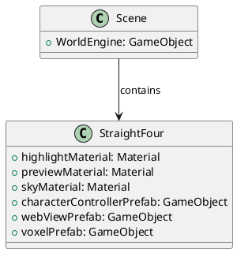
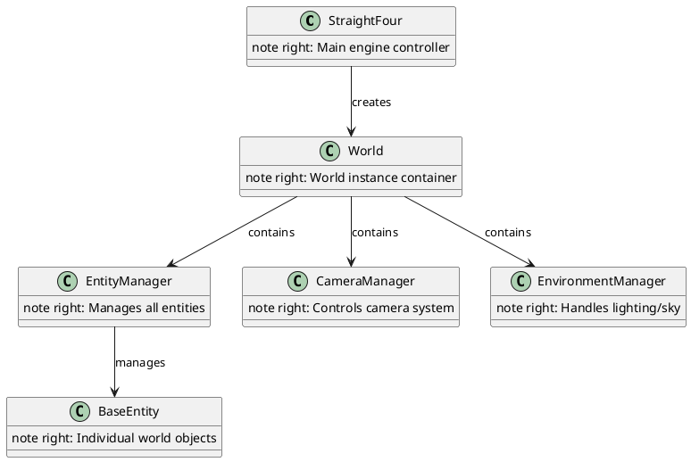

# Getting Started

This guide will help you quickly set up and start using the WebVerse World Engine in your Unity project.

## Prerequisites

Before you begin, ensure you have:

- **Unity 2021.3.26 or later** with Universal Render Pipeline (URP)
- **Git** for version control
- **Basic Unity knowledge** - Understanding of GameObjects, Components, and Scenes
- **C# programming experience** for custom functionality

## Quick Start

### 1. Clone the Repository

```bash
git clone https://github.com/dyfios/WebVerse-WorldEngine.git
cd WebVerse-WorldEngine
```

### 2. Open in Unity

1. Launch Unity Hub
2. Click "Add project from disk"
3. Navigate to the cloned repository folder
4. Select the project and click "Open"

### 3. Verify Setup

After Unity loads the project:

1. Check that Universal Render Pipeline is active
   - Go to `Edit > Project Settings > Graphics`
   - Verify "Scriptable Render Pipeline Settings" shows a URP asset
2. Ensure the Input System is enabled
   - Go to `Edit > Project Settings > Player > Other Settings`
   - Set "Active Input Handling" to "Input System Package (New)"

## Basic World Creation

### Step 1: Create a Scene

1. Create a new scene: `File > New Scene > 3D (Built-in)`
2. Save the scene as "MyFirstWorld"

### Step 2: Add the StraightFour Component

1. Create an empty GameObject in the scene
2. Rename it to "WorldEngine"
3. Add the `StraightFour` component to it

### Step 3: Configure Required Assets

The `StraightFour` component requires several prefabs and materials. Here's a minimal setup:



#### Create Basic Materials

1. **Highlight Material**
   - Create: `Assets > Create > Material`
   - Name: "HighlightMaterial"
   - Set color to bright yellow or orange
   - Set Rendering Mode to "Transparent"

2. **Preview Material**
   - Create another material
   - Name: "PreviewMaterial"  
   - Set color to semi-transparent blue
   - Set Rendering Mode to "Transparent"

3. **Sky Material**
   - Create: `Assets > Create > Material`
   - Name: "SkyMaterial"
   - Change Shader to "Skybox/6 Sided" or "Skybox/Procedural"

#### Create Basic Prefabs

1. **Character Controller Prefab**
   - Create an empty GameObject
   - Add `CharacterController` component
   - Add a Capsule child for visual representation
   - Create prefab in `Assets/Prefabs/`

2. **WebView Prefabs** (Optional - requires Vuplex WebView)
   - If you have Vuplex WebView, use their prefabs
   - Otherwise, create empty GameObjects for now

### Step 4: Assign Assets to StraightFour

In the Inspector for your WorldEngine GameObject:

1. Drag your materials to the respective material slots
2. Drag your prefabs to the respective prefab slots
3. Set VR to false (unless you have VR setup)

### Step 5: Create Your First World

Create a script to load your world:

```csharp
using UnityEngine;
using FiveSQD.StraightFour;

public class WorldLoader : MonoBehaviour
{
    void Start()
    {
        // Load a simple world
        bool success = StraightFour.LoadWorld("MyFirstWorld");
        
        if (success)
        {
            Debug.Log("World loaded successfully!");
            CreateSampleEntities();
        }
        else
        {
            Debug.LogError("Failed to load world");
        }
    }
    
    void CreateSampleEntities()
    {
        // Get the active world's entity manager
        var entityManager = StraightFour.ActiveWorld?.entityManager;
        if (entityManager == null) return;
        
        // Create a simple cube
        CreateCube(entityManager);
        
        // Create a light
        CreateLight(entityManager);
        
        // Create terrain (optional)
        // CreateTerrain(entityManager);
    }
    
    void CreateCube(FiveSQD.StraightFour.Entity.EntityManager entityManager)
    {
        // Create a basic cube mesh
        Mesh cubeMesh = GameObject.CreatePrimitive(PrimitiveType.Cube).GetComponent<MeshFilter>().mesh;
        Material[] materials = { new Material(Shader.Find("Universal Render Pipeline/Lit")) };
        
        entityManager.LoadMeshEntity(
            mesh: cubeMesh,
            materials: materials,
            position: Vector3.zero,
            rotation: Quaternion.identity,
            scale: Vector3.one,
            tag: "SampleCube"
        );
        
        Debug.Log("Created sample cube");
    }
    
    void CreateLight(FiveSQD.StraightFour.Entity.EntityManager entityManager) 
    {
        entityManager.LoadLightEntity(
            parentEntity: null,
            position: Vector3.up * 5f,
            rotation: Quaternion.Euler(50f, -30f, 0f),
            lightType: LightType.Directional,
            intensity: 1.0f,
            color: Color.white,
            tag: "SunLight"
        );
        
        Debug.Log("Created directional light");
    }
}
```

### Step 6: Run Your World

1. Add the `WorldLoader` script to any GameObject in your scene
2. Press Play in Unity
3. Check the Console for success messages
4. You should see your cube and lighting in the Scene view

## Understanding the Architecture

### World Hierarchy



### Basic Workflow

1. **Initialize**: StraightFour initializes the engine
2. **Load World**: Create a World instance with managers
3. **Create Entities**: Use EntityManager to create objects
4. **Interact**: Entities respond to user input and physics
5. **Update**: System continuously updates and synchronizes

## Creating Different Entity Types

### Mesh Entities (3D Objects)

```csharp
// Load a custom 3D model
entityManager.LoadMeshEntity(
    mesh: myMesh,
    materials: myMaterials,
    position: new Vector3(0, 0, 5),
    rotation: Quaternion.identity,
    scale: Vector3.one * 2f, // Double size
    tag: "CustomModel"
);
```

### Terrain

```csharp
// Create simple terrain
float[,] heights = new float[33, 33]; // 33x33 heightmap
for (int x = 0; x < 33; x++)
{
    for (int z = 0; z < 33; z++)
    {
        heights[x, z] = Mathf.PerlinNoise(x * 0.1f, z * 0.1f);
    }
}

entityManager.LoadTerrainEntity(
    length: 100f,
    width: 100f,
    height: 20f,
    heights: heights,
    layers: new TerrainEntityLayer[0], // No texture layers for now
    layerMasks: new Dictionary<int, float[,]>(),
    id: System.Guid.NewGuid(),
    parent: null,
    position: Vector3.zero,
    rotation: Quaternion.identity,
    tag: "MainTerrain",
    onLoaded: () => Debug.Log("Terrain created!")
);
```

### Characters

```csharp
// Create a character
entityManager.LoadCharacterEntity(
    parent: null,
    characterPrefab: characterControllerPrefab,
    position: new Vector3(0, 1, 0),
    rotation: Quaternion.identity,
    id: System.Guid.NewGuid(),
    tag: "Player",
    onLoaded: () => Debug.Log("Character spawned!")
);
```

### UI Elements

```csharp
// Create world-space UI
entityManager.LoadUIEntity(
    parent: null,
    position: new Vector3(0, 2, 3),
    rotation: Quaternion.identity,
    size: new Vector2(400, 300),
    id: System.Guid.NewGuid(),
    tag: "InfoPanel",
    renderMode: RenderMode.WorldSpace
);
```

## Working with the Camera

### Basic Camera Control

```csharp
// Get camera manager
var cameraManager = StraightFour.ActiveWorld?.cameraManager;

// Position the camera
cameraManager.SetCameraPosition(new Vector3(0, 5, -10));
cameraManager.SetCameraRotation(Quaternion.Euler(15, 0, 0));

// Enable/disable crosshair
cameraManager.crosshairEnabled = true;
```

### VR Setup

If you want to enable VR:

1. Install Unity XR Management package
2. Install your VR SDK (Oculus, OpenVR, etc.)  
3. Set up XR Rig in your scene
4. Enable VR in StraightFour component: `vr = true`

## Environment Configuration

### Lighting

```csharp
// Get environment manager
var envManager = StraightFour.ActiveWorld?.environmentManager;

// Set ambient lighting
envManager.SetAmbientLighting(Color.white, 0.3f);

// Configure fog
envManager.SetFog(true, Color.gray, 10f, 100f);
```

### Skybox

```csharp
// Set custom skybox
envManager.SetSkybox(mySkyboxMaterial);
```

## Entity Management

### Finding Entities

```csharp
// Get entity by ID
System.Guid entityId = myEntity.id;
BaseEntity entity = entityManager.GetEntity(entityId);

// Get all entities
BaseEntity[] allEntities = entityManager.GetAllEntities();

// Get entities by tag
BaseEntity[] cubes = entityManager.GetEntitiesByTag("SampleCube");
```

### Modifying Entities

```csharp
// Move an entity
entity.SetPosition(new Vector3(5, 0, 5));

// Rotate an entity
entity.SetRotation(Quaternion.Euler(0, 45, 0));

// Change interaction state
entity.SetInteractionState(InteractionState.Static); // Non-interactive
```

### Deleting Entities

```csharp
// Delete a specific entity
entityManager.DeleteEntity(entityId);
```

## Common Patterns

### Entity Hierarchy

```csharp
// Create parent entity
var parent = CreateParentEntity();

// Create children
var child1 = CreateChildEntity(parent);
var child2 = CreateChildEntity(parent);

// Moving parent moves all children
parent.SetPosition(new Vector3(10, 0, 0));
```

### Entity Events

```csharp
public class EntityInteraction : MonoBehaviour
{
    void OnEntityClicked(BaseEntity entity)
    {
        Debug.Log($"Clicked entity: {entity.id}");
        
        // Highlight the entity
        entity.SetInteractionState(InteractionState.Placing);
    }
    
    void OnEntityHover(BaseEntity entity)
    {
        // Show tooltip or highlight
    }
}
```

## Debugging and Troubleshooting

### Common Issues

1. **World doesn't load**
   - Check that all required prefabs are assigned
   - Verify materials are properly configured
   - Check Console for error messages

2. **Entities don't appear**
   - Ensure camera is positioned correctly
   - Check entity positions (might be at origin)
   - Verify materials have proper shaders

3. **Performance issues**
   - Limit number of active entities
   - Use LOD system for complex meshes
   - Check for memory leaks

### Debug Tools

```csharp
// Enable debug logging
FiveSQD.StraightFour.Utilities.LogSystem.LogInfo("Debug message");

// Check world state
if (StraightFour.ActiveWorld != null)
{
    Debug.Log($"World loaded: {StraightFour.ActiveWorld.siteName}");
    Debug.Log($"Entity count: {StraightFour.ActiveWorld.entityManager.GetAllEntities().Length}");
}
```

## Next Steps

Once you have a basic world running:

1. **Read the [Architecture Overview](../architecture/README.md)** to understand the system better
2. **Explore [Entity Types](../entities/README.md)** to learn about all available entities
3. **Check [API Reference](../api/README.md)** for detailed method documentation
4. **Try [Examples](../examples/README.md)** for more complex scenarios
5. **Learn about [Configuration](../configuration/README.md)** for advanced setups

## Sample Project

A complete sample project is available in the repository under `Samples/BasicWorld/`. This demonstrates:

- Basic world setup
- Multiple entity types
- User interaction
- Camera controls
- Environment configuration

Load this sample to see a working example of all the concepts covered in this guide.

## Getting Help

If you encounter issues:

1. Check the [API Reference](../api/README.md) for method signatures
2. Look at the [Examples](../examples/README.md) for usage patterns
3. Review the source code for implementation details
4. Check Unity Console for error messages
5. Verify all prerequisites are met

The WebVerse World Engine provides a powerful foundation for creating immersive virtual worlds. Start with these basics and gradually explore the more advanced features as your project grows!